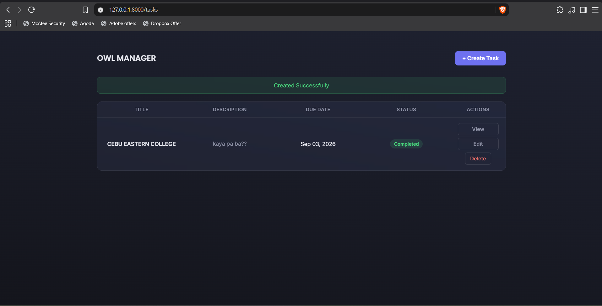
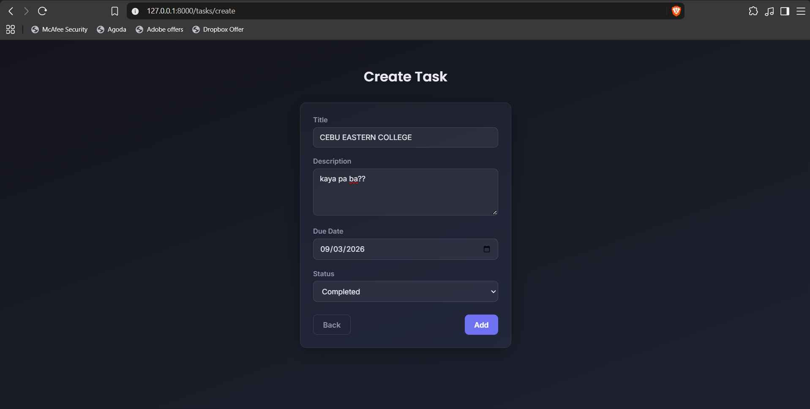
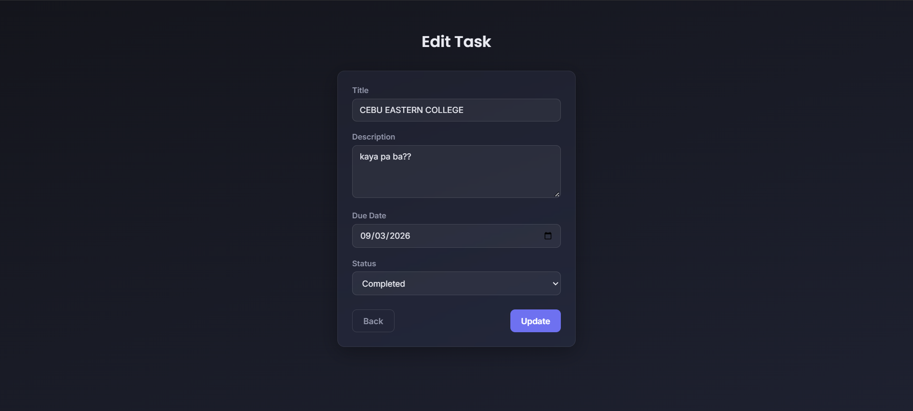

<h1><center>Owl TaskManager</center></h1>

Project Code: WST21-PM-2026-SF

Student Name: Buhangin, Rhaneil S.

Course & Year: BSIT 2nd Year

Database Used: MySQL

<h1>Features:</h1>
 
 - Add Task
 - View Tasks
 - Edit Task
 - Delete Task
 - Update Status

<h1>Structure of the website</h1>

```
WST3/TaskManager
├── app/
│   ├── Http/Controllers/
│   │   └── TaskController.php
│   └── Models/
│       └── Task.php
├── database/
│   └── migrations/
│       ├── ..._create_tasks_table.php
│       └── ..._change_description_to_text...php
├── resources/
│   └── views/
│       └── task/
│           ├── main.blade.php
│           ├── create.blade.php
│           ├── edit.blade.php
│           └── show.blade.php
└── routes/
    └── web.php
```

<h1>Output of the website</h1>

MainDashboard


Create Task


Edit Task


View Task

